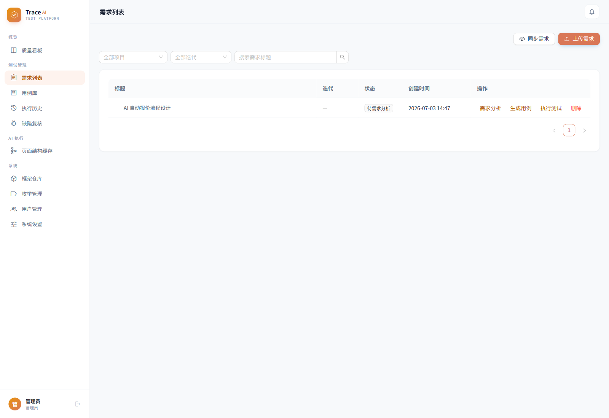
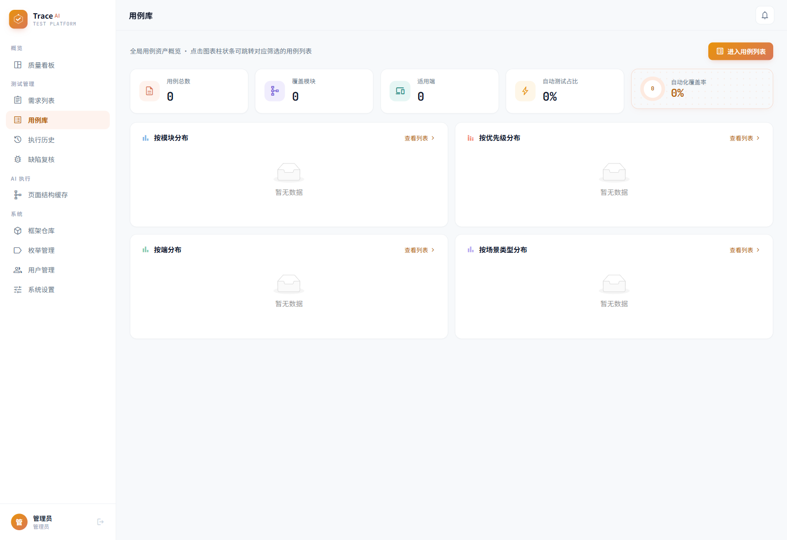
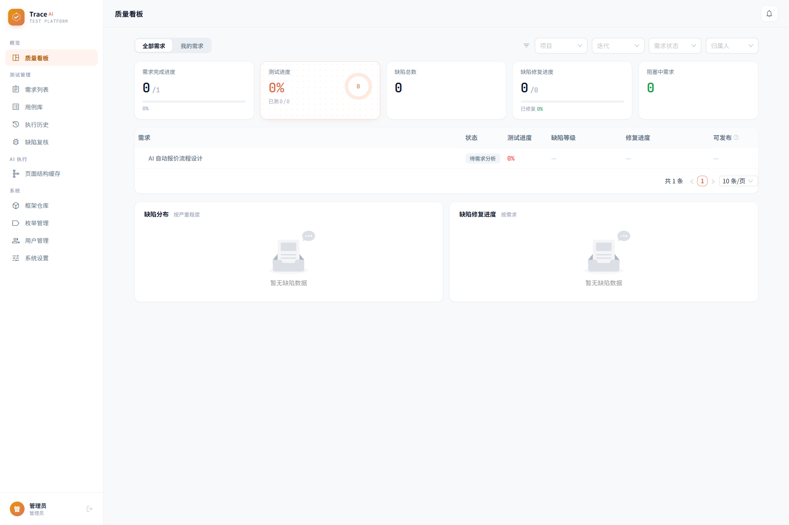
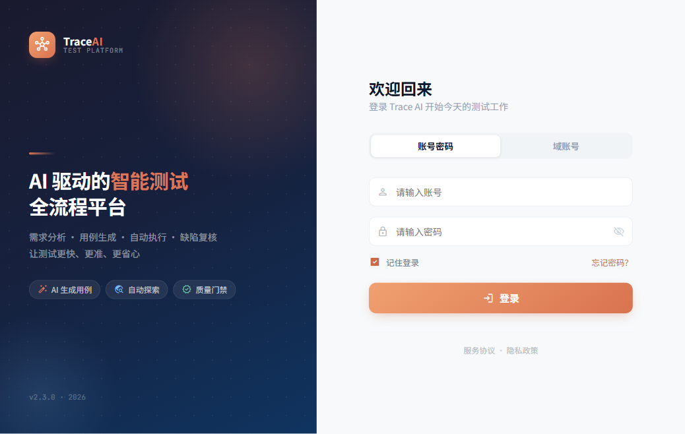
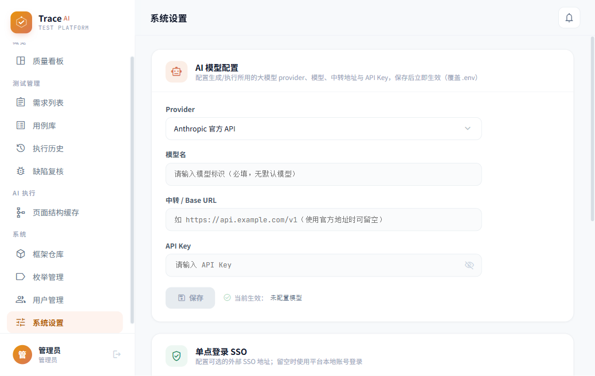

# TraceAI Test Platform

[](LICENSE)
[](https://fastapi.tiangolo.com/)
[](https://react.dev/)
[](https://www.postgresql.org/)
[](https://playwright.dev/)

[中文](README.md) | English

TraceAI is an AI-assisted quality collaboration and validation platform for teams. It covers requirement analysis, validation case generation, API/Web/App execution, defect review, and quality gates, and is built with FastAPI, React, PostgreSQL, Redis, Playwright, and Android device helpers.

> The project is still in an early stage. Evaluate it in an isolated environment first, and do not commit production secrets, real business data, or live sessions into the repository.

## Product Positioning

TraceAI Test Platform is designed for end-to-end quality collaboration across product, engineering, and QA teams. It connects requirements, test cases, execution, defect review, and release gates into a traceable workflow. AI assistance is used to accelerate analysis and drafting, while structured cases, execution evidence, and human review keep the final quality decision auditable.

The open-source edition is intentionally generic, deployable, and extensible. It does not bind to private business systems and does not include real accounts, requirements, datasets, app packages, or private environment configuration. External systems, AI providers, device clouds, and automation frameworks are enabled only through explicit configuration.

## Who It Is For

- Teams with dedicated QA roles as well as product and engineering members collaborating on quality
- Teams without a formal QA role that still want to standardize requirement checks, regression validation, and defect review
- Teams that need to cover API, desktop web, Android real devices, or Sonic cloud device execution
- Teams that want AI assistance while keeping human review and explicit quality gates

## What You Can Do With It

- Turn requirement docs, feature notes, or existing assets into risk points, validation checkpoints, and regression scope
- Manage API, Web, and App validation assets with reviews, version history, and execution records
- Run Android validation tasks on local devices, remote workers, or Sonic cloud devices
- Review request traces, screenshots, failure reasons, and quality gate outcomes through a unified result model
- Build a collaborative quality workflow even when the team does not have dedicated QA members yet
- Extend it as an internal quality platform without bundling private business data into the repository

## Typical Workflow

1. Product managers or engineers register requirements, API details, or existing validation assets.
2. The platform uses AI to generate risk points, validation suggestions, and executable case drafts.
3. The team chooses API, Web, or App execution for a project.
4. The platform stores execution results, screenshots, request traces, failure causes, and defect review records.
5. Quality gates help decide whether the release is ready.

## Feature Overview

| Capability Area | Description |
|---|---|
| Requirement Analysis | Register requirement documents and feature notes, then use AI assistance to extract risks, open questions, coverage suggestions, and regression scope. |
| Case Management | Manage structured API, Web, and App cases with priorities, steps, expectations, covered items, review feedback, versions, and execution history. |
| Multi-Channel Execution | Run API direct checks, desktop Web Playwright flows, Android device jobs, remote worker jobs, and Sonic cloud device jobs through a unified execution model. |
| Execution Evidence | Store request traces, screenshots, error messages, execution logs, and quality gate results for defect triage, review, and release assessment. |
| Defect Review | Support failure diagnosis, human review, defect confirmation, and rule-based quality decisions instead of relying on raw automation status alone. |
| Configuration Center | Configure product lines, modules, platforms, environment URLs, AI, SSO, Feishu, Sonic, automation frameworks, and execution parameters in one place. |
| Extension Integrations | Provide extension points for external task systems, automation framework repositories, application packages, code impact analysis, and quality rules. |

## Execution Notes

- API execution can resolve target environments from structured case metadata such as `tags.api_spec.service` or `tags.api_spec.base_url`, which helps reuse host mappings maintained by external API frameworks.
- Execution routing can follow platform enum `parent_key` values instead of relying only on historical hard-coded platform names.
- If an App case is misclassified into PC/Web, the runner stops with an explicit error instead of falling back to the wrong site.
- The desktop Web AI runner can now adopt newly opened tabs or windows after a click, which is useful for workspace and reporting systems that commonly open new pages.
- Temporary Web login can receive the current environment base URL, and when no external framework mapping exists for a platform, it can fall back to a generic username/password login flow.

## Latest Open-Source Update

This open-source update syncs the latest platform capabilities and prepares the repository for public use with generic configuration and privacy cleanup. Highlights include:

- Added quality-loop capabilities such as covered items, quality rules, experience mining, code impact analysis, test data preparation, page cache, and execution evidence.
- Improved execution routing across API, Web, and App channels, reducing reliance on historical platform names or private environment assumptions.
- Enhanced the Web runner with new-window adoption and expanded App execution support, including login recipes, navigation recipes, OCR helpers, and remote execution support.
- Converted external task systems, interface login, Web login, and automation framework bindings into generic configuration-driven integrations.
- Removed business-specific examples, private paths, real accounts, login state files, uploads, build artifacts, and local caches from the public repository surface.
- Updated bilingual documentation, configuration notes, deployment scripts, and security reminders for first-time self-hosted evaluation.

## Core Modules

| Module | Purpose |
|---|---|
| Requirements and Analysis | Record requirements, identify risks, and generate validation suggestions |
| Cases and Assets | Manage API, Web, and App cases and their versions |
| Execution Center | Launch API direct runs, Playwright runs, device runs, or Sonic runs |
| Defects and Review | Aggregate failures and support human review and defect confirmation |
| System Configuration | Manage enums, environment URLs, AI settings, external systems, and security parameters |

## Open-Source Edition Boundaries

- The open-source edition ships with the minimum runnable feature set so teams can validate the workflow first
- The repository does not include real requirements, accounts, business data, app packages, or private configurations
- AI, Sonic, Feishu, external task systems, and automation frameworks are optional integrations rather than startup prerequisites
- It is best suited for self-hosted internal use and further team-specific extension

## Roadmap

- Continue improving consistency across API, Web, and App execution flows
- Lower the adoption barrier for teams without dedicated QA roles
- Expand open-source documentation, deployment guidance, and security baselines
- Keep third-party integrations disabled by default and sensitive fields empty by default

## Architecture

```text
Browser -> React/Nginx -> FastAPI -> PostgreSQL
                            |  |
                            |  +-> Redis/RQ
                            +----> AI provider / Playwright / Sonic
                            +----> Windows/macOS worker -> Android device
```

See the [architecture document](docs/architecture.md) for details and [CHANGELOG.md](CHANGELOG.md) for release notes.

## Documentation Map

| Document | Best For |
|---|---|
| [Quick Start](docs/quick-start.md) | Running the platform locally for the first time |
| [Docs Overview](docs/README.md) | Browsing all documents and reading order |
| [Configuration](docs/configuration.md) | AI, Sonic, external systems, and security settings |
| [Architecture](docs/architecture.md) | Understanding system structure and extension points |
| [Deployment](docs/deployment.md) | Server and shared-environment deployment |
| [Contributing](CONTRIBUTING.md) | Preparing changes or pull requests |
| [Security](SECURITY.md) | Security reporting and deployment baseline |

## Screenshots

The images below are real screenshots from the current open-source edition.

### Core Workflow

<p align="center">
  
</p>

<p align="center">
  
</p>

<p align="center">
  
</p>

### Entry and Configuration

<p align="center">
  
  
</p>

## Quick Start

Requirements: Docker Engine 24+, Docker Compose v2, and at least 4 CPU cores with 8 GB RAM recommended.

```bash
cp .env.example .env
cp backend/.env.example backend/.env
docker compose -f docker-compose.prod.yml up -d --build
```

Open `http://localhost` and sign in with `admin` / `admin`.

On first startup, the platform runs database migrations, writes generic enums, and creates a demo project if no project exists yet.

> `admin` / `admin` is only intended for the first local login. Before using the platform in any shared environment, change the default admin password, the database password, and `JWT_SECRET`.

See [docs/quick-start.md](docs/quick-start.md) for the full getting-started guide and [docs/deployment.md](docs/deployment.md) for deployment notes.

## What You See After First Login

- A default administrator account: `admin` / `admin`
- A generic enum set for product lines, modules, platforms, and environment URLs
- An auto-created demo project with prefix `DEMO`
- Empty but usable requirement, case, execution, and defect pages for first-time evaluation

The platform does not seed real business requirements, scripts, execution results, or private project data.

## Recommended Reading Order

1. Start with [Quick Start](docs/quick-start.md)
2. Continue with [Configuration](docs/configuration.md)
3. Then read [Architecture](docs/architecture.md) and [Deployment](docs/deployment.md)
4. Finally review [Contributing](CONTRIBUTING.md) and [Security](SECURITY.md) if you plan long-term maintenance

## Production Checklist

- Change `POSTGRES_PASSWORD` in `.env`
- Change `JWT_SECRET` in `backend/.env`
- Replace the default admin password and stop using `admin` / `admin`
- Configure AI, Sonic, Feishu, or external systems only when needed
- Prepare backups for PostgreSQL, uploads, and execution artifacts

## FAQ

### Why does `admin` / `admin` fail?

The default credentials are only created on first initialization when no admin account exists in the database. Changing environment variables later does not reset an existing password automatically.

### Why is there only one demo project?

The open-source edition ships with a minimal runnable dataset so teams can enter the system and validate the workflow without shipping private business assets.

### Can I use it before configuring AI?

Yes. Basic browsing, local login, project management, and system settings work without AI. AI-dependent analysis, generation, and real execution features require explicit model configuration.

## Development

```bash
# backend
cd backend
python -m venv .venv
.venv/Scripts/pip install -r requirements.txt   # Windows
python -m pytest -q

# frontend
cd frontend
npm ci
npm run build
```

Read [CONTRIBUTING.md](CONTRIBUTING.md) and [SECURITY.md](SECURITY.md) before contributing.

## License

This project is released under the [Apache License 2.0](LICENSE). Third-party components remain under their own licenses.
