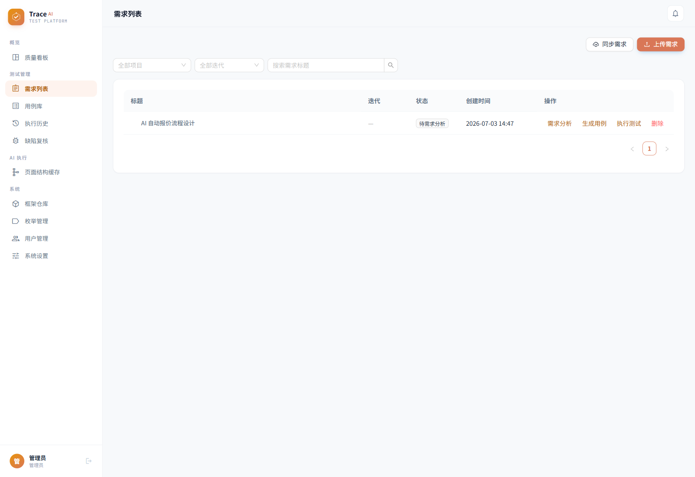
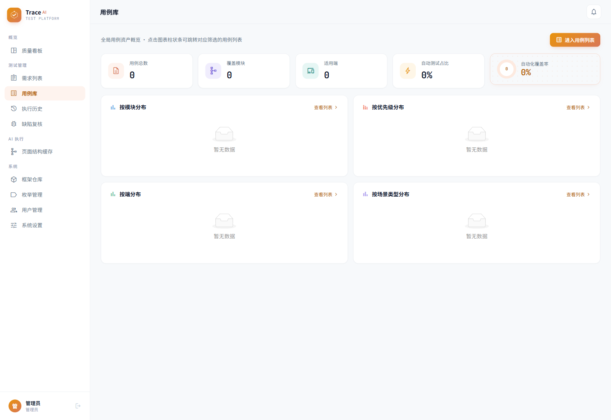
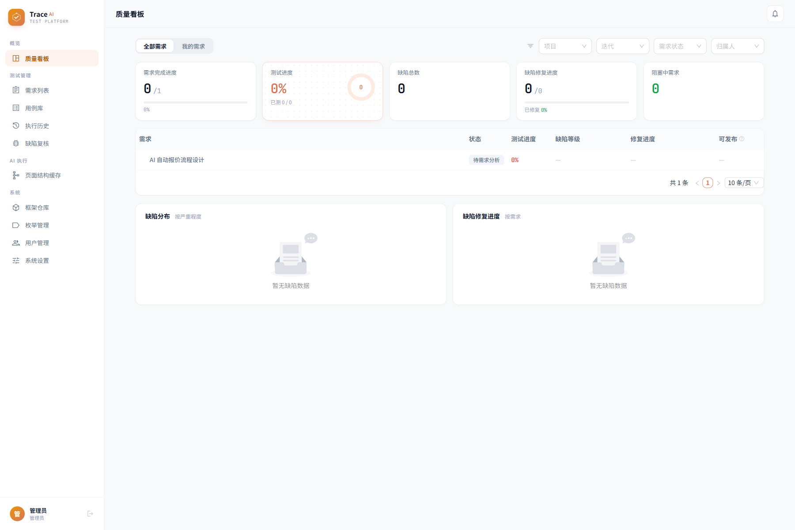
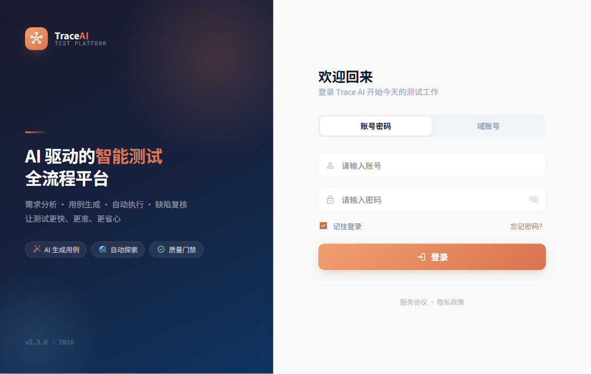
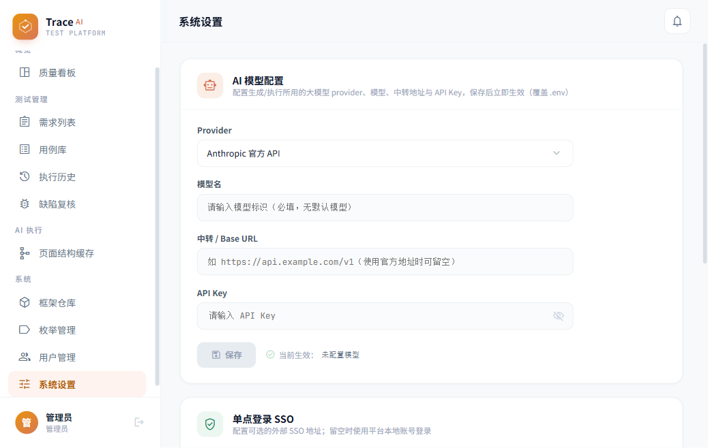

# TraceAI Test Platform

[](LICENSE)
[](https://fastapi.tiangolo.com/)
[](https://react.dev/)
[](https://www.postgresql.org/)
[](https://playwright.dev/)

中文 | [English](README.en.md)

一套面向团队的 AI 驱动质量协作与验证平台，覆盖需求分析、校验用例生成、接口/Web/App 执行、缺陷复核与质量门禁。项目采用 FastAPI、React、PostgreSQL、Redis、Playwright 与 Android 真机执行助手构建。

TraceAI is an AI-assisted quality collaboration and validation platform for teams. It covers requirement analysis, validation case generation, API/Web/App execution, defect review, and quality gates, and is built with FastAPI, React, PostgreSQL, Redis, Playwright, and Android device helpers.

> 当前项目处于早期阶段，建议先在隔离的测试环境中评估。不要将生产密钥、真实客户数据或登录态提交到仓库。
>
> The project is still in an early stage. Evaluate it in an isolated environment first, and do not commit production secrets, real customer data, or live sessions into the repository.

## 适合谁

- 有专职测试，也有产品、开发共同参与质量保障的团队
- 还没有测试岗位，但希望先把需求校验、回归验证和缺陷复盘流程沉淀下来的团队
- 需要同时覆盖接口、PC Web、Android 真机或 Sonic 云真机执行场景的团队
- 希望在自有环境中接入 AI 能力，但保留人工复核和质量门禁的团队

## 你可以用它做什么

- 基于需求文档、功能说明或现有资产梳理风险点、校验点和回归范围
- 管理接口、Web、App 多类型校验用例，并记录评审、版本和执行历史
- 在本地真机、远程 worker 或 Sonic 云真机上执行 Android 验证任务
- 通过统一结果模型查看请求轨迹、截图、失败原因和质量门禁结果
- 在没有专职测试岗位时，先把产品、开发、运营协同的质量流程沉淀下来
- 在不绑定私有业务数据的前提下，作为团队内部质量平台继续扩展

## 典型使用方式

1. 产品或开发录入需求、接口信息或已有校验资产。
2. 平台结合 AI 生成风险点、校验建议和可执行用例草稿。
3. 团队按项目选择接口、Web 或 App 方式发起验证执行。
4. 平台统一沉淀结果、截图、请求轨迹、失败原因和缺陷复核记录。
5. 在发布前通过质量门禁判断是否达到上线条件。

## 功能

- AI 辅助需求分析、风险点拆解和校验用例生成
- 接口、Web、App 多类型校验资产管理，包含评审、版本记录与执行历史
- 接口直连、PC Web、Android 真机与 Sonic 云真机执行能力
- App 安装包下载、卸载旧包与安装指定版本的扩展接口
- 缺陷诊断、人工复核和质量门禁
- 可选飞书、外部 SSO/任务系统和外部自动化框架集成
- 枚举驱动的产品线、模块、端和环境地址配置

## 执行补充说明

- 接口执行支持按结构化用例中的 `tags.api_spec.service` 或 `tags.api_spec.base_url` 解析目标环境地址，便于复用外部接口框架维护的域名配置。
- 执行路由支持按平台枚举的 `parent_key` 判定 `api`、`web`、`app` 等执行口径，减少依赖历史写死端名。
- App 用例如果被误分到 PC/Web，会直接报错并阻止兜底执行，避免把结果落到错误站点。
- PC Web AI 执行支持点击后自动接管新开的标签页或窗口，适配 CRM/报表类系统常见的新开页场景。
- Web 临时账号登录支持透传当前环境地址；当外部框架未覆盖某个端时，可降级到通用账密登录流程。

## 核心模块

| 模块 | 作用 |
|---|---|
| 需求与分析 | 记录需求、提炼风险点、生成校验建议 |
| 用例与资产 | 管理接口、Web、App 多类型用例与版本 |
| 执行中心 | 发起接口直连、Playwright、真机或 Sonic 执行 |
| 缺陷与复核 | 汇总失败结果，支持人工复核与缺陷确认 |
| 系统配置 | 管理枚举、环境地址、AI、外部系统与安全参数 |

## 开源版边界

- 默认提供最小可运行能力，方便团队先验证流程，再按需接入自己的业务资产
- 仓库不包含真实需求、真实账号、真实测试数据、真实安装包或任何私有业务配置
- AI、Sonic、飞书、外部任务系统和外部自动化框架都采用“可选接入”方式，不是启动前置条件
- 更适合部署在团队自己的环境中，作为内部质量协作平台继续扩展

English summary:

- The open-source edition ships with the minimum runnable feature set so teams can validate the workflow first.
- The repository does not include real requirements, accounts, business data, app packages, or private configurations.
- AI, Sonic, Feishu, external task systems, and automation frameworks are optional integrations rather than startup prerequisites.
- It is best suited for self-hosted internal use and further team-specific extension.

## Roadmap

- 持续完善接口、Web、App 多执行端的一致性体验
- 持续降低没有专职测试团队的接入门槛
- 持续补充开源版示例说明、部署指导和安全基线
- 持续保持第三方集成默认关闭、敏感信息默认留空

## 技术架构

```text
Browser -> React/Nginx -> FastAPI -> PostgreSQL
                            |  |
                            |  +-> Redis/RQ
                            +----> AI provider / Playwright / Sonic
                            +----> Windows/macOS worker -> Android device
```

详细说明见 [架构文档](docs/architecture.md)。
版本变化见 [CHANGELOG](CHANGELOG.md)。

## 文档导航

| 文档 | 适合场景 |
|---|---|
| [快速开始](docs/quick-start.md) | 第一次把项目跑起来并登录 |
| [文档总览](docs/README.md) | 快速浏览所有文档入口和阅读顺序 |
| [配置说明](docs/configuration.md) | 配置 AI、Sonic、外部系统和安全参数 |
| [架构文档](docs/architecture.md) | 了解前后端、执行器和 worker 关系 |
| [生产部署](docs/deployment.md) | 部署到服务器或共享环境 |
| [贡献指南](CONTRIBUTING.md) | 准备二次开发或提交 PR |
| [安全政策](SECURITY.md) | 报告漏洞和查看部署安全基线 |

## 页面预览

下面展示的是开源版当前真实页面截图，便于快速了解主要工作界面。

### 核心工作流

<p align="center">
  
</p>

<p align="center">
  
</p>

<p align="center">
  
</p>

### 入口与配置

<p align="center">
  
  
</p>

## 快速启动

要求：Docker Engine 24+、Docker Compose v2，建议至少 4 核 CPU、8 GB 内存。

```bash
cp .env.example .env
cp backend/.env.example backend/.env
```

首次本地体验可直接启动；默认登录账号和密码均为 `admin`：

```bash
docker compose -f docker-compose.prod.yml up -d --build
```

访问 `http://localhost`，使用 `admin` / `admin` 登录。首次启动会自动执行数据库迁移、写入通用枚举，并在项目表为空时创建“示例项目”。

示例项目只提供页面操作所需的项目上下文和质量门禁配置，不包含虚假需求、用例或执行结果；已有项目不会被覆盖。

> `admin` / `admin` 仅用于首次本地登录。部署到共享网络或生产环境前，必须在 `.env` 中修改 `DEFAULT_ADMIN_PASSWORD`，并同时替换数据库密码和 `JWT_SECRET`。

更多方式见 [快速开始](docs/quick-start.md) 和 [生产部署](docs/deployment.md)。

English quick start:

1. Copy `.env.example` to `.env` and `backend/.env.example` to `backend/.env`.
2. Run `docker compose -f docker-compose.prod.yml up -d --build`.
3. Open `http://localhost` and sign in with `admin` / `admin`.
4. Change the default password, database password, and `JWT_SECRET` before using the platform in any shared environment.

## 首次登录后你会看到什么

- 一个默认管理员账号：`admin` / `admin`
- 一套通用枚举配置，用于产品线、模块、端和环境地址等基础下拉项
- 一个自动创建的“示例项目”，项目前缀为 `DEMO`
- 空白但可操作的需求、用例、执行和缺陷页面，方便直接体验流程

平台不会自动写入业务需求、业务脚本、虚假执行记录或任何私有项目数据。

## 推荐阅读顺序

1. 先看 [快速开始](docs/quick-start.md)，确认本地能启动并登录。
2. 再看 [配置说明](docs/configuration.md)，补齐 AI、设备或外部系统配置。
3. 需要团队落地时，再看 [架构文档](docs/architecture.md) 和 [生产部署](docs/deployment.md)。
4. 打算长期维护或开源协作时，再看 [贡献指南](CONTRIBUTING.md) 与 [安全政策](SECURITY.md)。

## 配置原则

- `.env`、登录态、上传文件、APK/IPA、数据库和构建产物均已加入 `.gitignore`。
- 仓库不包含任何真实 API Key、密码、内网地址、客户名称或业务包。
- 外部系统默认关闭，只有显式设置环境变量后才启用。
- AI 输出不能替代人工判断；高风险缺陷和发布门禁应保留人工复核。

完整变量见 [配置说明](docs/configuration.md)。

## 生产前必须处理

- 修改 `.env` 中的 `POSTGRES_PASSWORD`
- 修改 `backend/.env` 中的 `JWT_SECRET`
- 修改默认管理员密码，避免继续使用 `admin` / `admin`
- 按需配置 AI Provider、Sonic、飞书或外部系统；不用的集成保持留空
- 为 PostgreSQL、上传目录和执行产物目录建立备份策略

## 开发

```bash
# 后端
cd backend
python -m venv .venv
.venv/Scripts/pip install -r requirements.txt   # Windows
python -m pytest -q

# 前端
cd frontend
npm ci
npm run build
```

提交代码前请阅读 [贡献指南](CONTRIBUTING.md) 和 [安全政策](SECURITY.md)。

## 常见问题

### 登录 `admin` / `admin` 失败

通常说明数据库里已经存在管理员账号。默认凭据只在首次初始化且管理员不存在时生效，修改环境变量也不会重置已有密码。

### 启动后页面空白或接口报错

优先检查容器状态、数据库迁移日志和 `backend/.env` 中的关键变量。未配置 AI 时，依赖 AI 的真实执行能力会明确报配置错误，但基础页面和本地登录仍可使用。

### 示例项目为什么没有需求和用例

开源版默认只提供“可进入系统并完成操作”的最小演示数据，不捆绑任何业务内容，避免误导为真实测试资产。

## 许可证

项目采用 [Apache License 2.0](LICENSE)。第三方组件仍受各自许可证约束。
