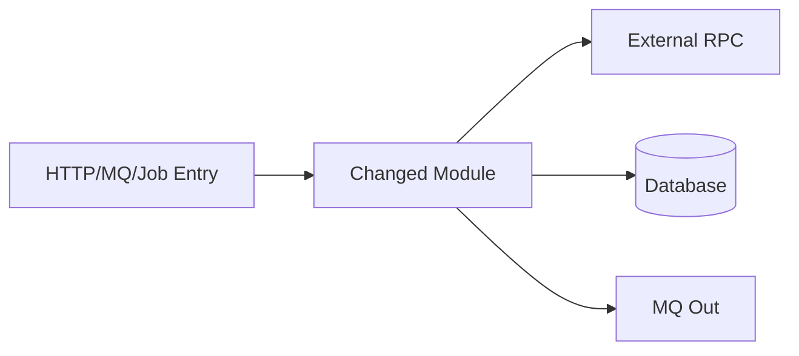

# Code Change Test Impact Analysis

Analyze what developers changed, trace impact through the codebase, and deliver actionable test scope for QA.

## When to Apply

Apply when the user wants any of:

- Impact analysis of code changes (功能点 / 逻辑 / 调用方)
- Test scope or regression recommendations
- PR / branch / commit review from a testing perspective
- Risk assessment before release testing

## Inputs — Resolve Before Analysis

Determine the change boundary. Ask only if missing:

| Input | How to obtain |
|-------|---------------|
| Change set | `git diff`, `git log`, PR diff, or user-specified files |
| Base branch | Default: repo default branch (`main` / `master`); user may override |
| Time range | e.g. "last week" → `git log --since="1 week ago"` |
| Context | Ticket ID, feature name, release version (optional but improves output) |

**Minimum viable input**: at least one of — commit range, branch name, PR URL/number, time range, or explicit file list.

## Analysis Workflow

Copy and track progress internally:

```
Impact Analysis Progress:
- [ ] Step 0: Load project context (if available)
- [ ] Step 1: Collect change summary + commit clustering
- [ ] Step 1.5: Java/Maven scan (if applicable)
- [ ] Step 2: Classify changes
- [ ] Step 3: Trace impact (features, logic, callers, extension points)
- [ ] Step 4: Assess risk + test coverage gap
- [ ] Step 5: Output test scope
```

### Step 0: Load Project Context (Optional)

Before git analysis, read project docs **if they exist** (do not require them):

| File pattern | Use for |
|--------------|---------|
| `AGENTS.md`, `README.md` | Module layout, run/build notes |
| `**/architecture.md`, `**/project.md` | Business domains, layer rules |
| `**/ddl.sql`, `**/migrations/**` | Schema baseline |
| `pom.xml` (root) | Maven modules list |

Detect project type:

- **Maven multi-module**: root `pom.xml` with `<modules>`
- **Single-module Java**: one `pom.xml`, no `<modules>`
- **Other**: follow generic workflow only

For Maven projects, also read [maven-guide.md](maven-guide.md).

### Step 1: Collect Change Summary

Resolve base ref first, then diff. Use shell-safe commands (works on bash and PowerShell):

```bash
# Time-based baseline (example: last week)
git rev-list -1 --before="1 week ago" HEAD

# Or branch-based
git merge-base main HEAD

# Then replace <BASE> with the commit hash
git log --oneline <BASE>..HEAD
git log --since="1 week ago" --format="%h|%an|%ad|%s" --date=short --no-merges
git diff --stat <BASE>..HEAD
git diff --name-status <BASE>..HEAD
```

**PowerShell note**: resolve `<BASE>` in a separate command; avoid nested `$(...)` if the shell fails.

Also check: renamed/moved files, deleted APIs, config/schema/migration files, `pom.xml` / lockfile changes.

#### Commit clustering

Group commits by theme (keywords in subject), not one row per commit:

```bash
git log <BASE>..HEAD --format="%s" --no-merges
```

Cluster examples: `feat/auth`, `fix/idempotent`, `chore/deps`, `refactor/extract`.  
**Output test scope by feature bundle**, not by individual file.

Produce a **Change Summary** table:

| Category | Files / Modules | Change Type |
|----------|-----------------|-------------|
| e.g. API layer | `*-api/src/...` | modified |

For Maven repos, group by module suffix (`*-api`, `*-biz`, `*-infra`, `*-web`, etc.) — see [maven-guide.md](maven-guide.md).

### Step 1.5: Java/Maven Scan (When Applicable)

If root `pom.xml` exists with `<modules>`, run the **Maven Multi-Module Scan Checklist** in [maven-guide.md](maven-guide.md).

Minimum scans:

1. `pom.xml` dependency version changes
2. DDL / migration / `*PO.java` / `*Mapper.xml`
3. Feign/RPC (`*Api.java`, `@FeignClient`), Controllers, Clients
4. MQ listeners (`@RocketMQMessageListener`, `@KafkaListener`, etc.)
5. Feature flags (`@Value`, `@ConfigurationProperties`, Apollo/Nacos annotations)
6. Jobs (`@XxlJob`, `@Scheduled`, `*Compensate*`)
7. Existing tests in changed modules (`**/*Test*.java`)

### Step 2: Classify Changes

Tag each changed unit with one or more labels:

| Label | Signals | Typical test focus |
|-------|---------|-------------------|
| `feature` | New user-facing behavior | Happy path + acceptance criteria |
| `bugfix` | Fixes reported defect | Repro steps + adjacent regression |
| `refactor` | Behavior-preserving restructure | Regression on same interfaces |
| `api-contract` | Request/response/DTO/schema change | Contract + backward compatibility |
| `data-model` | DB schema, PO/Entity, migrations | Data integrity + migration executed |
| `config` | Feature flags, env, constants | ON/OFF matrix + default/fallback |
| `dependency-bump` | `pom.xml` / Gradle version change | Integration smoke + changelog |
| `messaging` | MQ consumer/producer change | Idempotency, retry, redelivery |
| `scheduled-job` | Cron, XXL-Job, batch task | Manual trigger + failure recovery |
| `infra` | CI, deploy, build scripts | Smoke + deployment path |
| `performance` | Caching, query, batching | Load + latency regression |
| `security` | Auth, permission, crypto | Security + negative cases |

### Step 3: Trace Impact

For each meaningful change, answer three dimensions:

#### 3.1 影响的功能点 (Affected Features)

- Map changed code → business feature / user story / endpoint / job / consumer
- Include **indirect** features: shared utils, base classes, fill/manager components
- Mark confidence: `直接` / `间接`; evidence: `高` / `中` / `低`

#### 3.2 逻辑变化 (Logic Changes)

For each affected unit, describe:

- **Before → After** behavior (1–2 sentences)
- Changed conditions, branches, state transitions
- New/removed edge cases or error paths
- Side effects: cache, async, retry, transaction, idempotency

#### 3.3 调用方 (Callers & Callees)

Trace both directions:

```
Upstream (who calls this)  →  Changed code  →  Downstream (what it calls)
```

Use codebase search for: direct callers, HTTP/RPC routes, Feign clients, MQ topics, scheduled jobs, existing tests.

List each with impact level: `高` / `中` / `低`.

**Stop rule**: Trace 2 hops upstream/downstream unless user requests deeper graph. Mark gaps as **未追踪**.

#### 3.4 Extension-point coverage (Required when applicable)

When new logic is wired into **shared extension points**, enumerate **all** implementations — do not assume only changed files are affected:

| Pattern | Search for |
|---------|------------|
| Strategy / Handler | `implements *Handler`, `extends Abstract*Handler` |
| Fill / Processor chain | `implements *Fill`, `*Processor`, `*Interceptor` |
| Event listener | `@EventListener`, `*Listener`, MQ consumers on same topic |
| API variant | V1/V2/V3 controllers or `*Api` Feign interfaces |

Output an **Entry Coverage Matrix**:

| 入口 / Handler / Listener | 是否接入新逻辑 | 证据 |
|---------------------------|----------------|------|
| XxxHandler | ✅ / ❌ / ❓ | diff or grep result |

#### 3.5 Stub / not-yet-implemented detection

In changed files, grep for:

`TODO`, `FIXME`, `待实现`, `not implemented`, empty method body, comment-only stubs

Mark as **「已接入但未生效」** → lower test priority (P3) or list under 待确认项. Do not write full test cases for unimplemented paths.

### Step 4: Risk Assessment

Score each affected feature area:

| Factor | High risk signals |
|--------|-------------------|
| Blast radius | Shared module, core path, payment/auth/order/tenant |
| Change type | New branch, removed validation, schema change, idempotency fix |
| Coverage gap | No `*Test*.java` near changed code |
| Data sensitivity | PII, money, permissions |
| Cross-service | Feign + MQ + DB in same feature |
| Release context | Hotfix, large diff, SNAPSHOT dependency |

Assign overall risk: **P0** / **P1** / **P2** / **P3**.

**Auto-upgrade to Deep Mode** when any:

- Diff > 30 files OR > 500 lines in core modules
- Same feature touches MQ + DB + external RPC
- Overall risk is P0

Risk-to-test depth: see [reference.md](reference.md).

## Output Format

Always deliver using this template. Write in the user's language (Chinese if they use Chinese).

```markdown
# 代码变更测试影响分析

## 1. 变更概览
- **分析范围**: [branch / commits / time range / PR]
- **对比基线**: [commit or branch]
- **变更规模**: [N files, +X/-Y lines, M commits]
- **功能聚类**: [bullet list of feature bundles]
- **变更摘要**: [1–3 sentences]

## 2. 影响分析

### 2.1 影响的功能点
| 功能/模块 | 影响类型 | 影响说明 | 置信度 |
|-----------|----------|----------|--------|

### 2.2 逻辑变化
| 位置 | 变化前 | 变化后 | 关注点 |
|------|--------|--------|--------|

### 2.3 调用关系
| 方向 | 调用方/被调用方 | 影响级别 | 说明 |
|------|-----------------|----------|------|

### 2.4 入口覆盖矩阵（如有 Handler/Listener/多版本 API）
| 入口 | 是否接入 | 证据 |
|------|----------|------|

## 3. 风险评估
| 区域 | 风险等级 | 理由 |
|------|----------|------|

**综合风险**: [P0–P3] — [justification]

## 4. 测试范围建议
### 4.1 必测 / 4.2 建议 / 4.3 可选 / 4.4 可不测

## 5. 推荐测试用例
| ID | 场景 | 前置条件 | 步骤 | 预期结果 | 优先级 |

## 6. 回归策略
- **冒烟** / **全量回归** / **自动化** / **环境/数据** / **发布验证**

## 7. 风险与待确认项
- [ ] ...
```

### Downloadable report

When the user asks for a file to download/share, write:

`<project-root>/docs/test-impact-analysis-<date-or-range>.md`

Use checklist syntax `- [ ]` in sections 6–7. Do not write to the repo unless the user asks.

## Test Design Rules

1. **Anchor on behavior**, not diff lines — every test item maps to a user-visible or contract-visible outcome.
2. **Bugfix rule**: Original defect reproduction + at least one adjacent regression case.
3. **Refactor rule**: Large diff → verify via callers even if "no logic change" is claimed.
4. **API rule**: Old clients vs new server when compatibility is unclear.
5. **Config/flag rule**: Test ON + OFF when flags touch changed code.
6. **Negative cases**: At least one failure case per new branch.
7. **Extension-point rule**: All handlers/listeners in matrix — mark ❓ as 待确认, not silent skip.
8. **Stub rule**: TODO/unimplemented code → P3 or 待确认, not P0.
9. **Gaps explicit**: Uncertain callers under 待确认项, not guessed.

## Lightweight vs Full Mode

| Mode | When | Depth |
|------|------|-------|
| **Quick** | "快速评估" or tiny change | Sections 1–4, top 5 test items |
| **Full** | Default for PR/release/time-range | Complete template |
| **Deep** | "深入分析" or auto P0/large diff | + mermaid call-chain + entry coverage matrix + per-entry test rows |

## Call-Chain Diagram (Deep Mode)



## Additional Resources

- Risk heuristics, Maven layer mapping: [reference.md](reference.md)
- Maven multi-module checklist: [maven-guide.md](maven-guide.md)
- Example outputs: [examples.md](examples.md)

## Anti-Patterns

- Do NOT equate "small diff" with "small impact".
- Do NOT list every file as a separate test item — group by feature bundle.
- Do NOT claim full caller coverage without search evidence.
- Do NOT recommend full-system regression unless P0 or user requests it.
- Do NOT treat Maven `*-api` DTO-only changes as low risk if Feign consumers exist elsewhere.
- Do NOT write P0 tests for code marked TODO / 待实现.
